# Crop Duster UAV

## 1. Introduction

This project was undertaken as part of a competition hosted by **NIT Calicut** during their Technical Fest (January 2022) — and we secured **1st place** in the finals. The primary objective was to design an efficient fixed-wing UAV that can carry and spray pesticides over agricultural fields, covering large areas quickly and efficiently. This report outlines the complete design methodology followed in building the UAV.

Crop dusting involves the aerial spraying of fertilizers over agricultural fields. The aircraft, known as a **Crop Duster**, was designed to **fertilize 0.125 acres** of land — considering the average field sizes in India.

### Design Constraints
  - **Fixed-wing UAV** configuration
  - Must fit within a **1200mm × 1200mm × 1200mm** carrying case (disassembled)
  - **Electric propulsion**
  - Payload capacity: **1 kg** of fertilizer

---

## 2. Design Process & Methodology

### 2.1 Aerofoil Selection

We began by analyzing **80 airfoils**. Seven with promising aerodynamic profiles were shortlisted for detailed batch analysis in **XFLR5**:

- **S1223**, **N22**, **N10**, **BE50**, **GOE52**, **AG37**, **GOE118**

The analysis was conducted across a Reynolds number range of **100,000 to 500,000** in 10,000 increments.

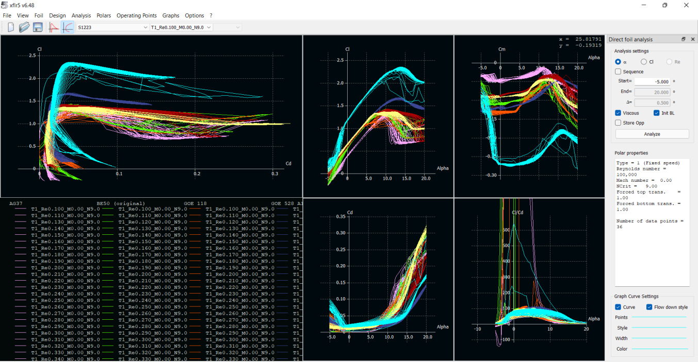  
*Batch Analysis – XFLR5 Results*

The **S1223 airfoil** (shown in light blue in the graph) performed best with:
- **Cl = 1.184**
- **Cd = 0.01786**
- **Cl/Cd = 66.32** at 0° angle of attack

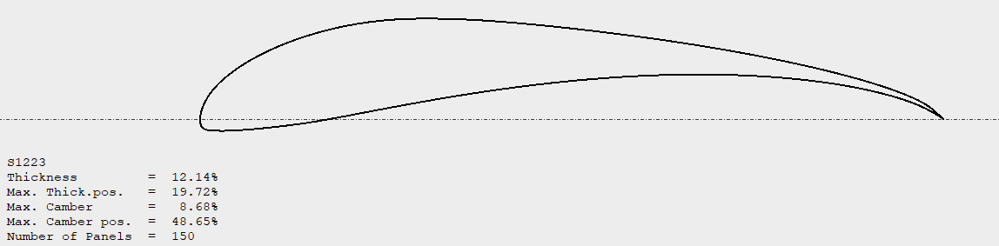

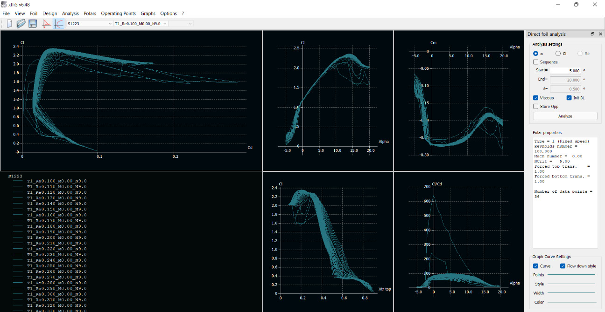
*XFLR5 Analysis of S1223 Airfoil*

---

### 2.2 Wing Planform & Fabrication

Various wing planforms (rectangular, tapered, swept back) were simulated and out of all, chosen design is:  
- **Rectangular central section with tapered winglets**  
- **Cl = 1.084**, **Cd = 0.044**, **Wing area = 0.72 m²**

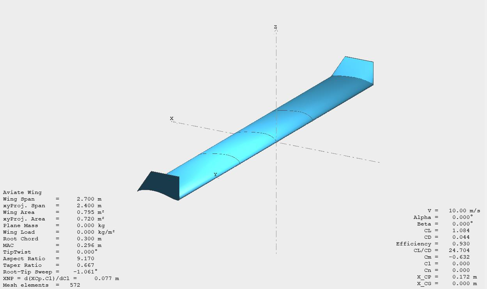  
*Custom Wing Model in XFLR5*

The wing was modeled in **three detachable parts** for portability and ease of assembly.

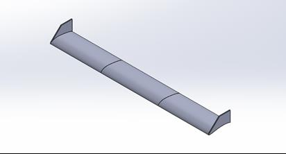  
*CAD Model – Wing Assembly*

The wings can be fabricated from **XPS foam** by CNC hot wire cutting and reinforced with **aluminum rods**:
  - Rod diameters: **24mm, 22mm, 12mm, 10mm**
  - Placement optimized based on high-pressure zones

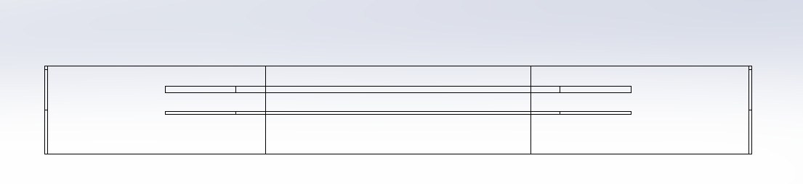
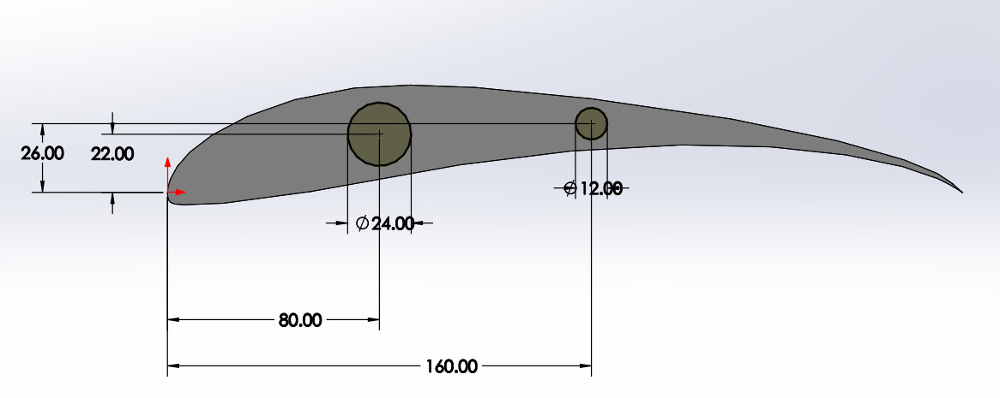
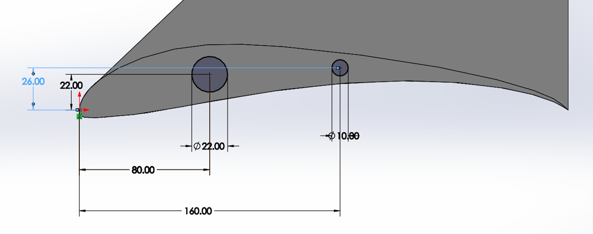
*Internal Structure & Rod Placement*

---

### 2.3 Structural Analysis

The structure was tested for following conditions to observe the stress distribution:
- Lift force: **40 N**
- Cruise speed: **10 m/s**

Results confirmed that both **stress and strain remained within safe limits**.

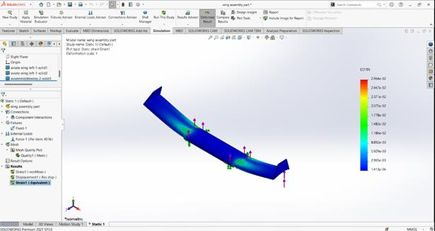  

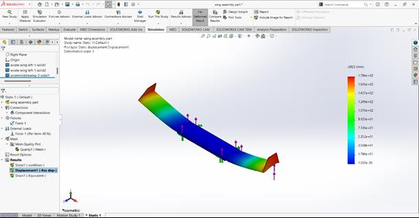

*Structural Stress Analysis – Wing*

---

### 2.4 Fuselage & Empennage Design

The fuselage follows an **airfoil-like shape** to minimize drag.
Chosen tail configuration: **Twin Boom High-Mounted Tail**, offering:
- Reduced wake at horizontal stabilizer  
- Lighter structure 
- Space for integrating spray mechanisms inside booms

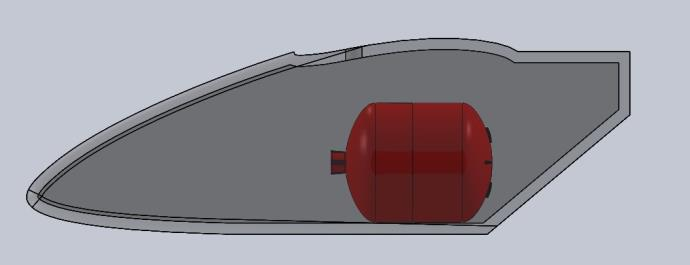

*Fuselage CAD*

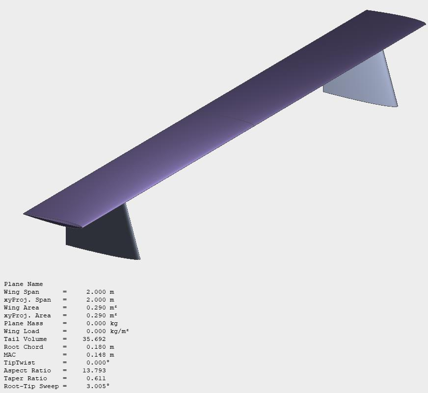

*Empennage CAD*

---

### 2.5 Stability & Control

- Longitudinal stability ensured by a **negative slope** of the **Cm vs. Alpha** curve
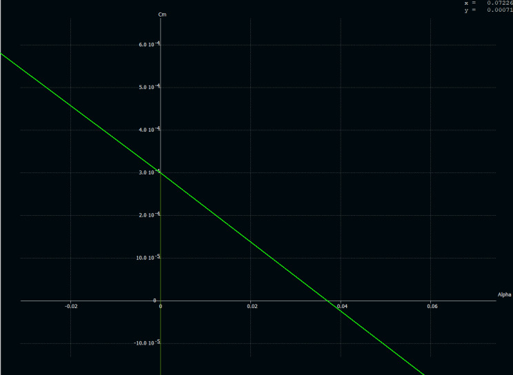

- Directional stability confirmed via **Cn vs. Beta** curve
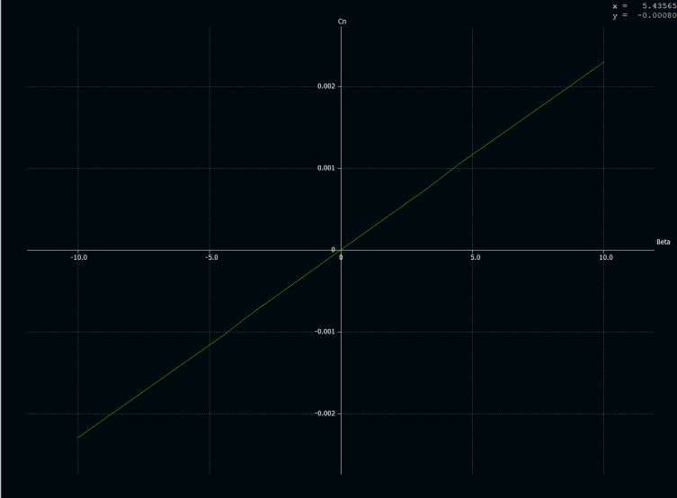

#### Static Margin:
- **Neutral Point (Xnp)**: 13.9 cm from wing LE  
- **CG (Xcg)**: 11.5 cm from wing LE  
- **Static Margin** = (Xnp - Xcg) / MAC = **0.08** (8%)

#### Control Surface Sizing:
- **Ailerons**: 7–8% of wing area, 20% of Aileron-to-wing chord ratio  
- **Elevator**: 25% of horizontal stabilizer area  
- **Rudder**: 25% of vertical stabilizer area

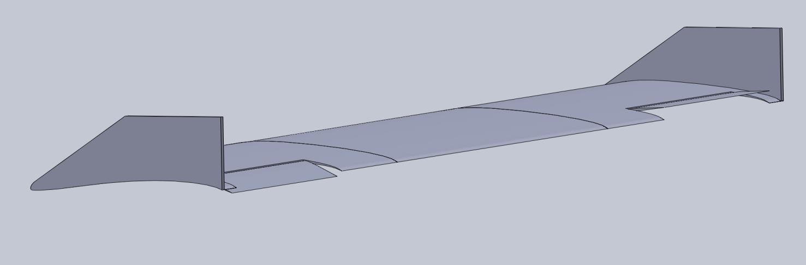
*Control Surface Implementation*

---

### 2.6 Materials Used

| Component              | Material                   |
|------------------------|----------------------------|
| Fuselage, Wings, Tail  |          XPS Foam          |
| Boom | Carbon fibre rods |
| Reinforcements         | Aero ply, Aluminum rods    |

---

### 2.7 Propulsion & Electronics

- **Motors**: 2× AT2814 Long Shaft (1050KV)
- **Propellers**: 11×5.5 inch
- **ESC**: 55A (based on current requirements)
- **Battery**: 5200 mAh 3S LiPo
- **Servos**: 16g for control surfaces

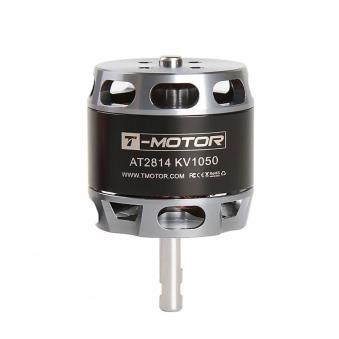
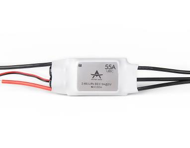

This motor-propeller combination provides a **maximum thrust** of **3500g**.

#### Weight Breakdown:
- Empty + Electronics: **1.6 kg + 0.8 kg**
- Wing lift capacity: **3.72 kg**
- Max payload (fertilizer): **~1.32 kg**

---

### 2.8 Fertilizer Dispersal Mechanism

The **fertilizer spraying system** was designed with:
- **Cylinder + Pump + Nozzles**
- Pump flow rate: **80 ml/s**
- Nozzle flow rate: **11 ml/s** (theoretical coverge area: $\phi$ = ~1m
- Nozzles: 6 total (2 per boom, 2 at wing ends)

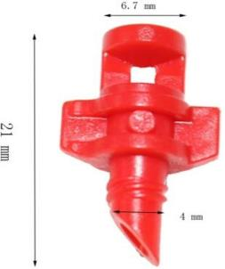
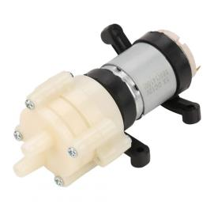

*Spray System*

---

### 2.9 Final Designs & Assembly

Final **2D Drawings** and **Exploded Views** were created for disassembled transportability.

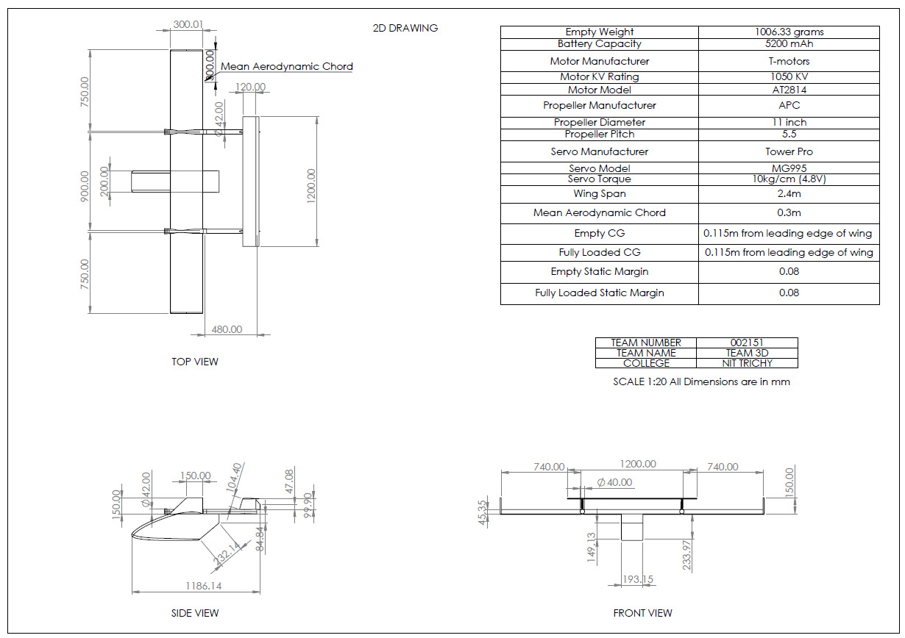 
*2D Drawing of the Aircraft*

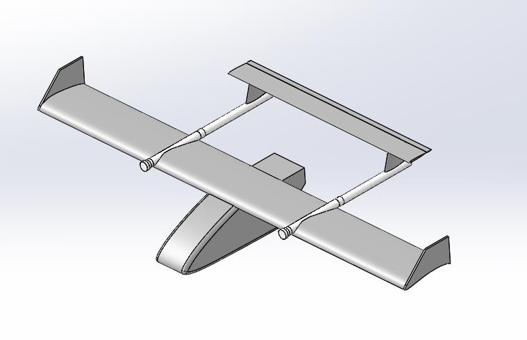 

*Final Assembled model*

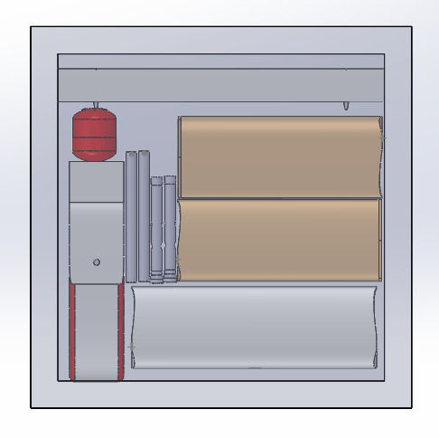

*Disassembled view*

---

## 3. My Role

- Performed **aerofoil analysis** and **batch simulations** in XFLR5  
- Contributed to the **wing planform design and structural layout**  
- Modeled components in **SolidWorks**   
- Worked on **fertilizer spraying system layout** and **weight analysis**

---

## 4. Tools Used

  - XFLR5
  - SolidWorks

---

## 5. Conclusion

### Highlights:
- **First Place** in NIT Calicut’s 2022 Tech Fest Competition 
- **Twin boom design** - reduced structural weight and drag
- **Unique spray layout** in booms offered more **uniform and efficient coverage** than traditional wing-mounted nozzles  
- Disassembled model of the aircraft was able to fit inside the box easily (with dimensions of 1.2m x 1.2m x 1.2m).

### Future scope:
- Integration of **autonomous flight systems** (GPS-guided spraying)
- Testing with **variable nozzle orientations** and **Larger payload capacity**
