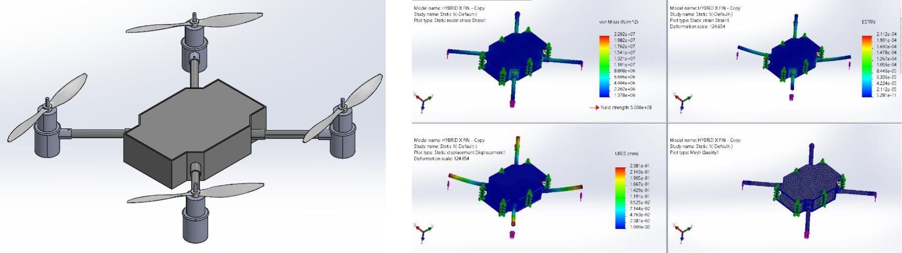

# SAE AeroTHON 2022 – Multirotor UAV for Autonomous Payload Delivery

## 1. Introduction

SAE Aerothon is a national-level UAV design competition organized by SAE (Society of Automotive Engineers) India, aimed at fostering innovation in aerospace and unmanned aerial systems. In this competition, student teams are challenged to design, fabricate, and demonstrate a multirotor UAV capable of delivering a payload to a target location using both manual and autonomous operations. The UAV must fall under the micro UAS category with a take-off weight less than 2 kg and a payload capacity of 200 g (payload dimensions: 10×5×5 cm³). The operational range is approximately 1 km.

The project involved a complete UAV development cycle—from configuration selection, frame and materials design, propulsion selection, simulation and structural validation, to the final development of a payload delivery system supported by vision-based target detection.

---

## 2. Methodology

### 2.1 Configuration and Design Approach

After evaluating various multirotor configurations, a **Quadcopter layout** was selected as the most suitable to meet mission requirements. Preliminary weight estimations were conducted to ensure the UAV remained within the micro category constraints. To achieve adequate thrust, a 2:1 thrust-to-weight ratio was targeted. Each motor was required to deliver at least 1260g of thrust, leading to the selection of **SunnySky X2212 1400KV motors** paired with **8038 propellers**. This combination was chosen for its efficient thrust-to-power output ratio.

A **4200mAh battery** was used to power the system, allowing for approximately 12 minutes of flight time. The **Pixhawk 2.4.8** flight controller was integrated, along with GPS and a 5.8 GHz radio transmission system for manual flight. A **Raspberry Pi 3B+** was also incorporated for controlling the payload drop mechanism in autonomous missions.

---

### 2.2 Frame and Structural Design

The drone’s structural design began with iterations of the hub plate considering the placement of electronics. Initial shapes such as **Hybrid X**, **Hybrid H**, and **H** frames were evaluated based on weight, stiffness, and vibration resistance.

- **Arms**: Constructed using cylindrical carbon-fibre tubes.
- **Motor mounts**: Fabricated from carbon-fibre plates and attached with silicone dampeners to reduce vibrations.
- **Arm fixture**: Designed as a rigid boundary enclosing the hub plate. It simplifies arm attachment to the hub plates and reduces the number of fasteners. It is 3D printed using continuous fibre-reinforced nylon composite.

The **hub plates** were manufactured using a **sandwich structure**: a **2mm balsa wood core** layered between **1.5mm carbon fiber sheets**. Epoxy is used as adhesive to bond carbon fibre sheet and balsa wood. Balsa wood is chosen as core material because of its high stiffness, impact strength, toughness, and comparatively less cost. Carbon fibre is used as it has density five times smaller and tensile strength ten times higher than the conventional high-strength steel. This composite offered high stiffness-to-weight and impact resistance than its constituent materials. To finalize the thickness of the sandwich structure for the hub plates, a structural analysis for different thicknesses were performed in SolidWorks.

*Carbon Fibre-Balsa composite (Left) and Carbon Fibre (Right)*

 

*Final combination of Carbon Fibre-Balsa composite (2mm-1.5mm-2mm)*

All three frame designs were structurally analyzed using 13N of applied force per arm. Although the **H frame** showed the highest stiffness, the **Hybrid X configuration** was chosen for its lighter weight, smaller volume, and resistance to torsional deformation.

*Hybrid X configuration*

 

*Hybrid H configuration*

 

*H configuration*

With **Hybrid X** as the final configuration, the sizing of the main frame of the drone was reiterated and optimized further. 

*Optimized configuration*

---

### 2.3 Aerodynamic Analysis

CFD simulations were carried out to assess the propeller performance and overall drone aerodynamics. 

- **Propeller analysis** - An enclosure around the quadcopter’s propellers was modeled to simulate the airflow using ANSYS Fluent.
  

  - **Lift generated**: ~19.65 N (more than estimated weight)
  
- **Aerodynamic analysis** was also extended to determine pressure and velocity variations across the frame and airspace.
   
  
  - **Drag force**: ~1.39 N

---

### 2.4 Electronics Integration

- Electronics are compactly placed on the hub plate considering the interference between components and the maximum area occupied.

---

### 2.5 Payload Delivery System

The payload drop mechanism was custom-designed and inspired by a **spinning-door mechanism**. It consists of:

- **Two T-doors** that hold the payload
- **Two hinges** acting as latches
- **Servos** to actuate latches and release payload

The mechanism was mounted slightly above the center of mass to reduce servo load. All components were **3D printed using PLA**, enabling easy integration and customization.

*CAD Model of Payload Mechanism*

 

*Working of Payload Mechanism*

---

### 2.6 Landing Gear Design

The landing gear is designed in similar to helicopter’s landing gear with two skids. It was designed to make sure it provides enough **ground clearance** and structurally strong and guides the drone for **stable take-offs and landings**. The landing gear was analysed with the force of 50N applied considering a factor of safety of 2.5 which resulted in the stresses induced much less the ultimate tensile stress.

*Landing gear CAD and Structural analysis*

---

### 2.7 Final Assembly and Center of Gravity Analysis

After assembling all structural parts and placing electronic components, the center of gravity (CG) was calculated and verified to lie near the geometric center, ensuring stable flight both longitudinally and laterally.

|  | X Axis | Y Axis |
|------|---------|--------|
| **Moment (Kg-m)** | -0.0004691 | -0.00107995 |
| **Mass (Kg)** | 1.94 | 1.94 |
| **C.G distance from geometric centre(m)** |  0.000286 | 0.0006577 |

*Center of Gravity analysis*

 

*Final assembled CAD model and Testing*

---

### 2.8 Power Distribution and Flight mission plan

- Power distribution flowchart
  

 

- Manual and Autonomous operation flowchart
  

---

### 2.9 Autonomous Target Detection

The UAV is designed to autonomously drop payloads on a color-coded target based on **image processing techniques**. A mounted camera feeds real-time data to the Raspberry Pi, which detects and confirms the correct drop target using the detection pipeline.
  
  *Autonomous search flow*

#### Target: Archery-style circle with red, blue, and yellow rings

#### Detection Pipeline (OpenCV + Python):
1. **Convert video feed to HSV color space** for better color segmentation under varying lighting.
2. **Apply Hough Circle Transform** to isolate circular targets.
3. **Mask red, blue, and yellow segments** using HSV hue thresholds.
4. **Apply morphological transforms** (closing) to clean up binary masks.
5. **Use contour detection and image moments** to find the center of each color region.
6. **Confirm target** if all detected color centers align with the circle’s center.
7. **Trigger payload drop** upon successful identification.

  
  *Image processing output of Target detection*

---

## 3. My Role

  - Contributed to the selection of the propulsion system, including motor–propeller combination, battery, and electronics.
  - Carried out structural analysis for the drone mainframe, particularly for H-frame configuration.
  - Worked on manufacturing carbon fiber–balsa composite plates and assembling the drone.
  - Involved in piloting and manual flight rounds testing.
  - Developed the image processing algorithm for target detection in autonomous missions.

---

## 4. Tools Used

| Tool | Purpose |
|------|---------|
| **SolidWorks** | CAD design and modeling |
| **ANSYS Fluent** | CFD analysis|
| **Python + OpenCV** | Target detection and payload dropping |
| **ROS, PX4, MAVROS** | UAV autonomous control |

---

## 5. Results

A fully functional quadcopter UAV was developed that met all the competition constraints, including payload dropping, flight time, and operational range. The quadcopter UAV successfully performed payload delivery both manually and autonomously at the target location.

### Innovations
- **Design**: Integrated arm fixture which reduced vibration and minimized the use of fasteners.
- **Material**: Carbon Fibre - Balsa composite sandwich structure provided better strength-to-weight ratio.
- **Payload dropping Mechanism**: Compact payload system with servo-activated latching; adaptable to any payload shape within constraints.

### Future Scope
- Payload bay can be extended for **multi-payloads** with sequential release.
- Improve detection algorithms for dynamic targets.
- Scale for larger UAV categories and higher payloads.

---
