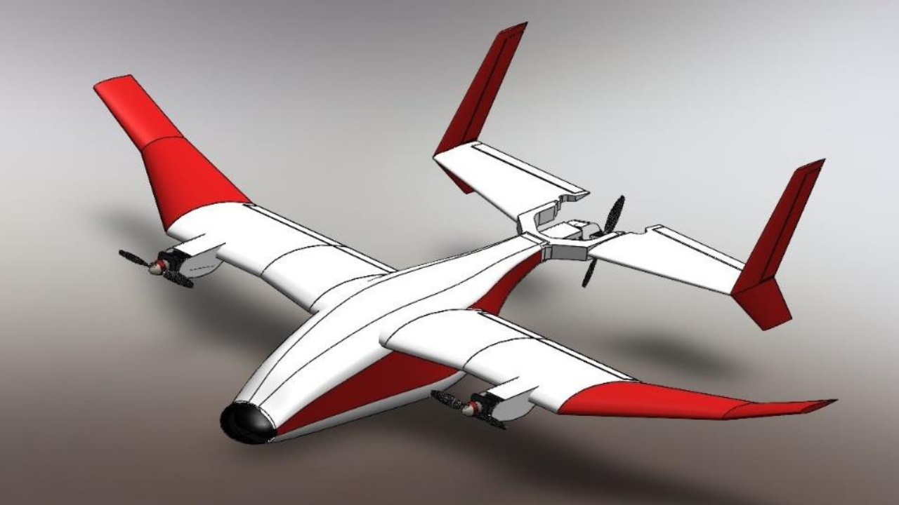

# VTOL

## 1. Introduction

This project focuses on designing a hybrid Vertical Take-Off and Landing (VTOL) Unmanned Aerial Vehicle capable of both vertical lift and forward flight, aimed at applications such as **aerial surveillance** and **payload transportation**. The primary goal is to integrate transition technology that allows seamless movement from multirotor hover mode to fixed-wing cruise mode in Tri-copter configuration.

---

## 2. Process & Methodologies

### 2.1 Initial Concept
The conceptualization began by analyzing mission requirements such as endurance, stability, structural simplicity, and aerodynamic performance (as this project was started for design competition conducted at Techfest, IIT Bombay). After a comparative study of different VTOL mechanisms like tail-sitters, tilt-wings, and tilt-rotors, the tilt-rotor configuration was chosen due to its simplicity and proven efficiency.

### 2.2 Aerofoil Selection

We began with aerofoil selection using **XFLR5** for aerodynamic analysis. Around **12 aerofoils** were considered initially, and a batch analysis was conducted. Based on performance, the following were shortlisted:
- **GOE225** – selected for its high lift coefficient (yellow)
- **NACA6409** – chosen for lower wing weight (blue)

After comparing key aerodynamic parameters like **Cl**, **Cd**, and **Cl/Cd**, **GOE225** was finalized.

  
*XFLR5 Aerofoil Analysis*

---

### 2.3 Wing Planform Design

- Near the fuselage: **trapezoidal**
- Mid-section: **rectangular** (to increase wing area)
- Wing tips: **tapered**, with a transition from **GOE225 to NACA0012** to reduce wingtip vortices

We aimed for an **aspect ratio of ~8**, suited for glider-like aircraft with relatively higher maneuverability. A freestream velocity of **14 m/s** was considered. The final design had:
- **Wingspan**: 2 m  
- **Root Chord**: 30 cm  
- **Tip Chord**: 13 cm

  
*Initial (left) and Final (right) Wing planform design*

We analyzed the wing across velocities from **8 m/s to 16 m/s** at **3° angle of attack**, resulting in:

| Velocity (m/s) | Lift (N) | Weight (kg) | Drag (N) |
|----------------|----------|-------------|----------|
| 8              | 15.598   | 1.591       | 0.560    |
| 10             | 24.372   | 2.487       | 0.875    |
| 12             | 35.097   | 3.581       | 1.260    |
| 14             | 47.771   | 4.874       | 1.715    |

---

### 2.4 Configuration and Structural Design

- **High-wing** configuration is choosen because it offers **high ground clearance**, **reduced ground effect**, and **greater stability** due to the center of mass being below the center of lift
- Wing is constructed with **rib structures and spars** for increased strength

- Stabilizer Aerofoils:
  - **Horizontal**: NACA0012
  - **Vertical**: NACA0008

- The profile of the plane's fuselage is designed such that it follows aerofoil contours for improved aerodynamics

---

### 2.5 Propulsion system

  - **BLDC motors**: AT2820 1250KV with 9x6 propellers
  - **ESC**: T-80A, chosen based on motor's peak current at full throttle
  - **Battery**: 4S LiPo battery (to achieve estimated weight of 1.7 kg at 70% throttle)
  - **Flight Controller**: Pixhawk 2.4.8 - chosen for VTOL compatibility

---

### 2.6 Rotor Placement and Transition Mechanism

- Three rotors form an **equilateral triangle**, with CG at the triangle’s centroid
- Wing rotors placed **10 cm ahead** of the wings to avoid interference and enable smooth VTOL ↔ Glider transitions

- #### Servo Mechanism:
  - **Wing rotors**: One servo per motor enables rotation from vertical to horizontal
  - **Tail rotor**: Two servos  
    - One compensates **yaw (gyroscopic stability)**  
    - One enables **rotation (0°–90°) transition**

 
*Front motor (left) and rear (Right) motor attachements*

- #### Final proposed model

*Final CAD Model with Rotor & Servo Placements*

---

### 2.7 Prototype & Testing

For testing tri-copter configuration, a **simplified rectangular wing planform** was used to ease fabrication. The structure incorporated:
- **Twin-boom support**  
- Frame made from **aluminum rods**  
- Wings: **rib structure reinforced with carbon fiber rods**
- Tail geometry adjusted to match prototype scale and aerodynamics

The modification for the prototype was done primarily with the goal of testing the transition mechanism in the Tri-copter configuration.

*Initial Prototype Model*

 
*Initial Prototype Testing*

---

## 3. My Role

- Conducted **aerofoil analysis** and **batch simulations** using XFLR5  
- Designed the **final wing planform** and selected appropriate aerofoils  
- Modeled the **CAD structure** in SolidWorks  
- Involved in **structural design decisions**, particularly wing ribs and fuselage shaping  
- Participated in **prototype fabrication** and **testing phase**

---

## 4. Tools Used

- XFLR5 (Design and primary analysis)
- SolidWorks (CAD model design)
- Fusion 360 (CAD model design)
- Ansys FLUENT (To verify the XFLR5 analysis)
- Fabrication (Laser cutting, Bandsaw, Monokote covering)
- ArduPilot and Mission Planner

---

## 5. Results, Conclusion & Future Scope

We successfully tested the prototype, including the **rotor transition mechanism**. Key highlights of the Tri-copter configuration VTOL:

- Capable of carrying payloads up to **4.5 kg**
- **Multirotor** - all motors facing up - High maneuverability and stability
- **Versatile horizontal flight** – operable with 1, 2, or all 3 motors  
  - **Mode 1** - Front motors enabled - Efficient forward flight  
  - **Mode 2** - Tail motor enabled - Low power consumption gliding
  - **Mode 3** - All three motors enabled - High-speed cruise

This concept is ideal for **aerial surveillance, logistics**, and **emergency operations** where VTOL and glide-based efficiency are required.
