# Fluid-Structure Interaction of Flexible beams using Smoothed-Particle Hydrodynamics

## 1. Introduction

The combination of high slenderness fibers and hyper-elastic materials presents an intriguing avenue of research with promising applications in various domains. High slenderness fibers, recognized by their exceptional length-to-diameter ratios, offer unique mechanical properties such as high tensile strength and low density. In parallel, hyper-elastic materials can undergo significant deformations and return to their original shape upon stress removal.

This synergy between high slenderness fibers and hyper-elastic materials has the potential to enhance stiffness, durability, and energy absorption capabilities—especially under demanding environments.

The motivation for this study originates from experimental observations in fluid dynamics, particularly the experimental analysis of various coatings of “hairy flap” used to control vortex shedding behind an immersed cylinder. This served as a foundation to understand the interaction between flexible materials and fluid flows. This experiment captures the complexity of immersed fiber interactions and serves as a template for understanding the global effects observed in other natural settings, such as terrestrial canopies and submerged vegetation. Despite the seemingly modest influence of individual immersed fibers on fluid flow, this research work sets the stage for future endeavors that aim to elucidate how the collective movement and interaction of a substantial fiber patch significantly alter vorticity and overall flow dynamics especially in aquatic domains.

This project utilizes DualSPHysics, an open-source CFD solver based on the Smoothed Particle Hydrodynamics (SPH) method. SPH is a Lagrangian-based meshless technique well-suited for problems involving large deformations and moving boundaries. It allows accurate modeling of fluid-structure interaction (FSI) without the need for constant remeshing. So , this method excels in situations involving flexible structures in a fluid domain, as they can adapt quickly to shape changes or distortions occuring at a higher rate.

The primary objective of this project is to use SPH to analyze the FSI behavior of a flexible beam immersed in fluid, with the goal of validating the simulation results obtained from mortar finite element method (FEM) and exploring how varying the beam’s material properties influences it's behavior.

---

## 2. Methodology

Initially, the SPH model is validated by comparing its results with those obtained from the mortar finite element method, ensuring the accuracy and reliability of the SPH-based simulations. Following the validation, a convergence study is conducted to assess the consistency of the SPH model's results. Then, a comparative analysis is undertaken on the flexible beam by varying its properties. This comprehensive investigation aims to elucidate the effects of property variations on tip velocities, fluid flow patterns around the beam, and the formulation of vorticity within the fluid domain.

### 2.1 Case Setup

The simulation was conducted within a 2D fluid channel, specifically designed for evaluating slender fiber deformation under high particle density conditions.

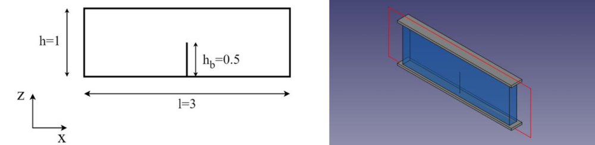
*Geometric representation of fluid channel (Left) and CAD model (Right)*

The fluid properties were configured to replicate water with:
- Density (ρ): 1 g/cm³
- Viscosity: 0.004

An inter-particle distance of 0.006 cm was chosen. All surfaces, except inflow and outflow regions, were modeled as rigid boundaries.

In the simulation setup, the inflowing fluid adopts a distinctive parabolic velocity profile that varies both spatially, following the channel's height, and temporally, oscillating with respect to time. This combination of spatially and temporally varying velocity profiles replicates wave-like effects typically encountered in real-world scenarios.

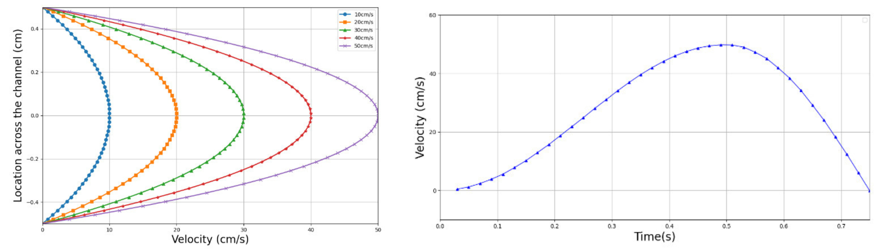
*Parabolic inflow fluid velocity profile (Left) and Velocity-Time variation (Right)*

The flexible beam was defined using the “flexstruc” library with the following material properties:

| Parameters | Value |
|------------|-------|
| Height | 0.5 cm |
| Cross-Sectional Area | 0.0001 sqcm |
| Density | 10 g/cm³ |
| Young's Modulus | 10⁶ Pa |

*Properties of Flexible Beam*

### 2.2 DualSPHysics Setup

The DualSPHysics configuration file included definitions of:
- Geometries
- Fluid and boundary properties
- Inflow velocity profiles
- Time-stepping and simulation parameters

  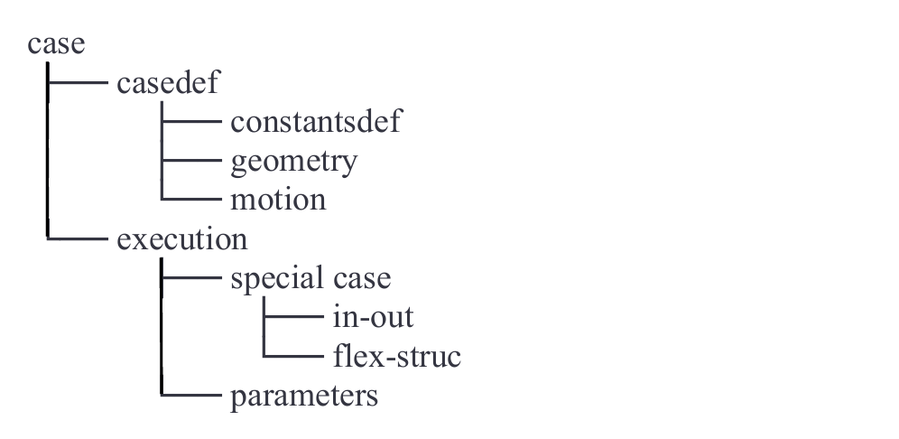
  *File setup description*

### 2.3 Validation

The SPH model was validated against mortar FEM results by configuring the simulation with identical parameters. The SPH simulation was run for 0.075 seconds, capturing output at various time steps for comparison.

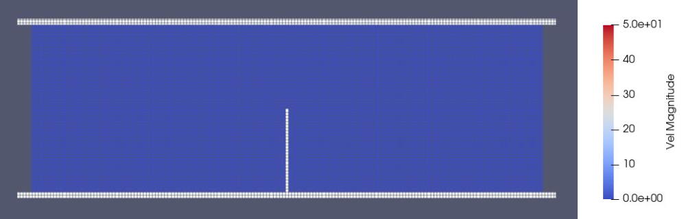
*Initial configuration (Left) and Velocity legend of the fluid (Right)*

 

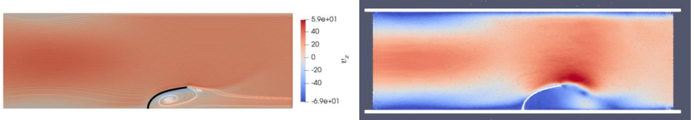
*Mortar finite element method (Left) and SPH (Right) results at t=0.062s*

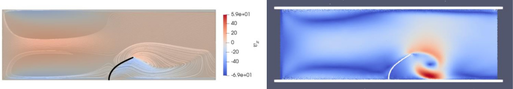
*Mortar finite element method (Left) and SPH (Right) results at t=0.074s*

Tip velocity and displacement were plotted across the time domain:
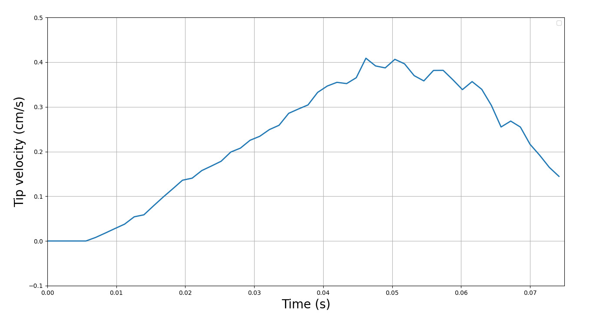
*Tip velocity of Flexible beam vs time*

 

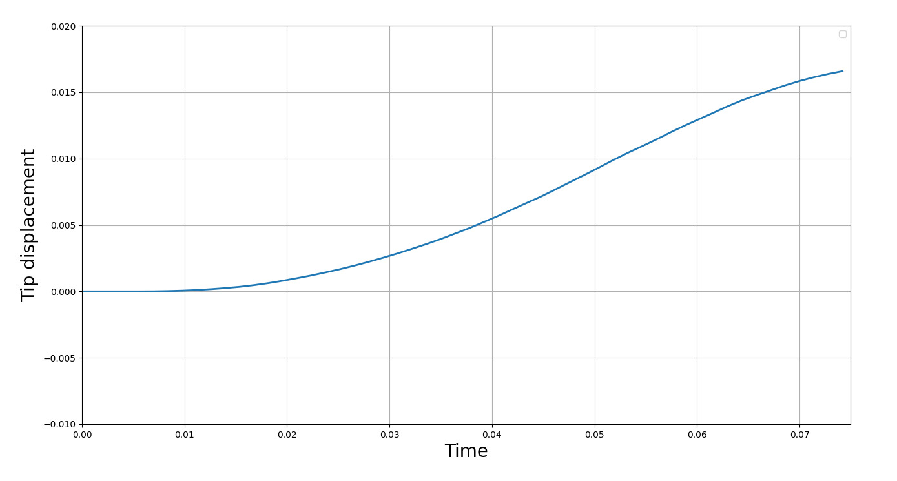
 *Displacement of Flexible beam vs time*

 

### 2.4 Convergence Study

A convergence study was conducted on the SPH simulation setup to ascertain the stability and consistency of the results. The simulation was executed across multiple interparticle distances and maximum tip displacement was analyzed across simulations.

| S.No. | Interparticle Distance (dp) | No. of Particles |
|-------|-----------------------------|------------------|
| Case_1 | 0.0025cm | 512,505 |
| Case_2 | 0.005cm | 128,573 |
| Case_3 | 0.006cm | 89,574 |
| Case_4 | 0.0075cm | 57,212 |

*Different cases considered for the convergence study*

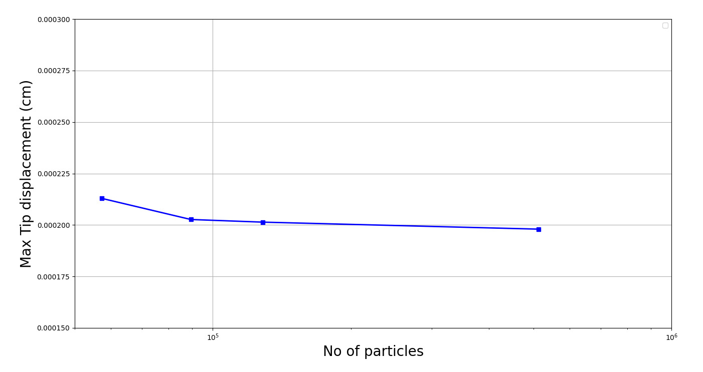
*Convergence study results*

The results were plotted with maximum tip displacement versus number of particles. Displacement values showed stability for inter-particle distances below 0.006 cm.

### 2.5 Study of Various Parameters

A systematic analysis was conducted by varying the Young's modulus of the beam while keeping other properties constant. Simulations were performed for three values of Young’s modulus:  
- E₁ = 1×10⁶ Pa  
- E₂ = 5×10⁶ Pa  
- E₃ = 1×10⁷ Pa

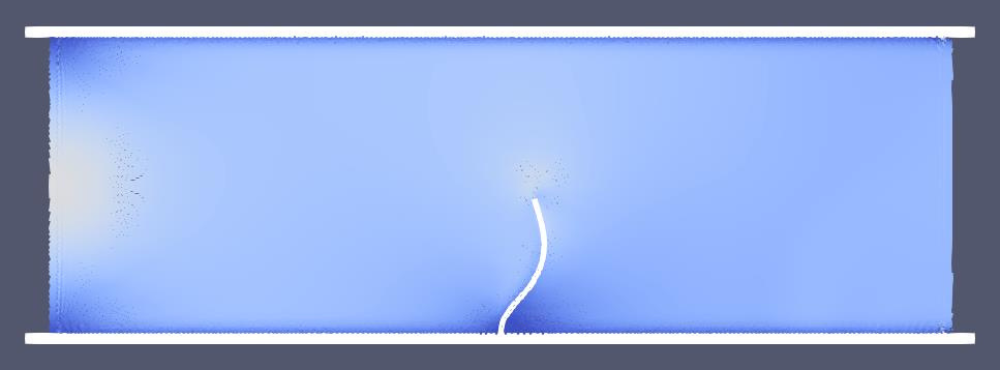
*Flow field visualisation at t=0.025s (E₁)*

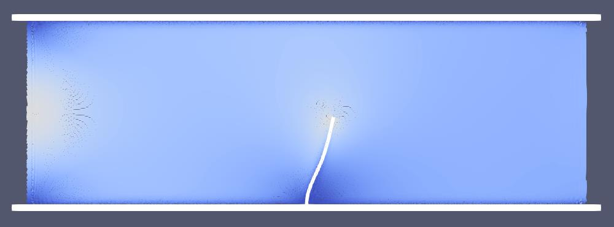
*Flow field visualisation at t=0.025s (E₂)*

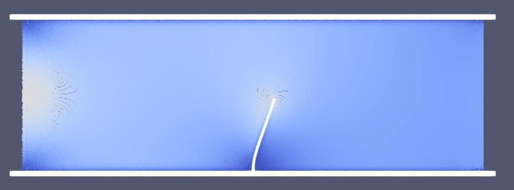
*Flow field visualisation at t=0.025s (E₃)*

 

For each case, flow field visualizations were captured at maximum fluid velocity (50 cm/s), where the beam was maximally deformed:

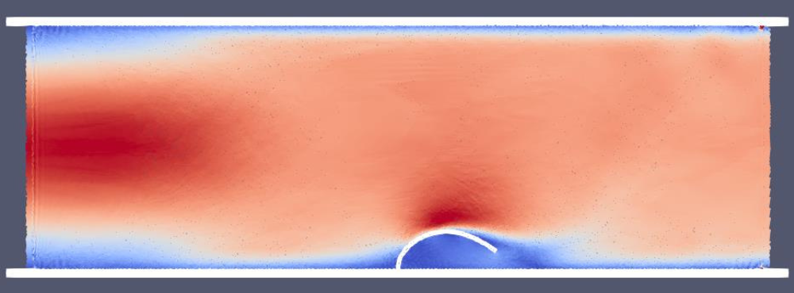
*Flow field visualisation at t=0.05s (E₁)*

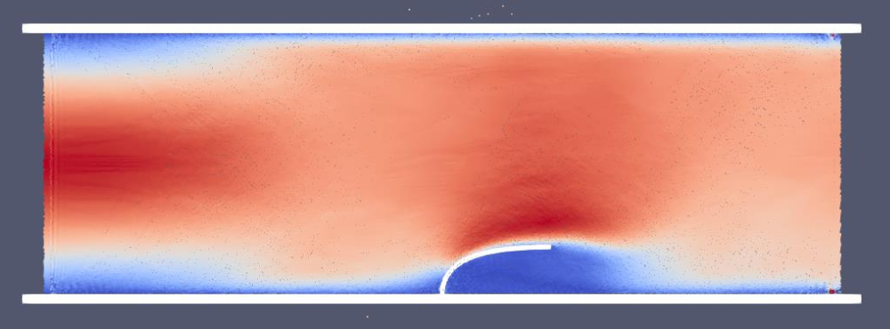
*Flow field visualisation at t=0.05s (E₂)*

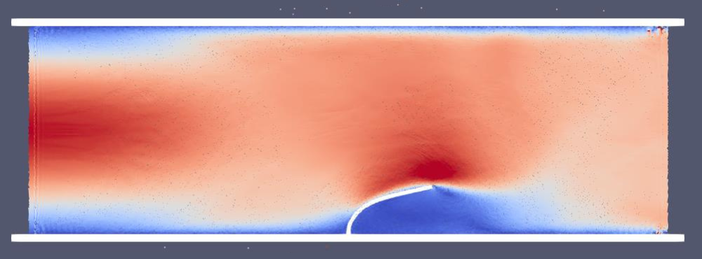
*Flow field visualisation at t=0.05s (E₃)*

 

Additional visualizations were taken when fluid inlet velocity was zero, showing the beam returning to its original shape:

 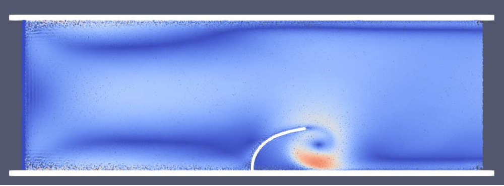
*Flow field visualisation at t=0.075s (E₁)*

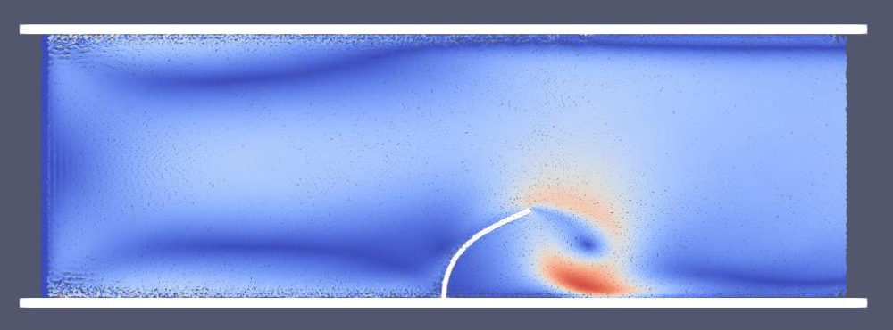
*Flow field visualisation at t=0.075s (E₂)*

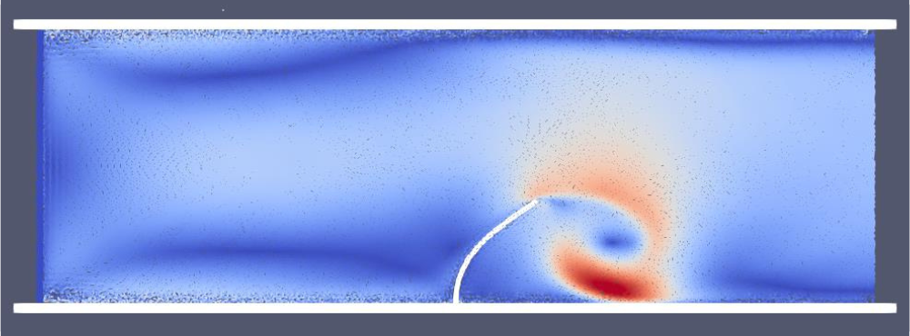
*Flow field visualisation at t=0.075s (E₃)*

 

The tip displacement results for all three cases were compared:
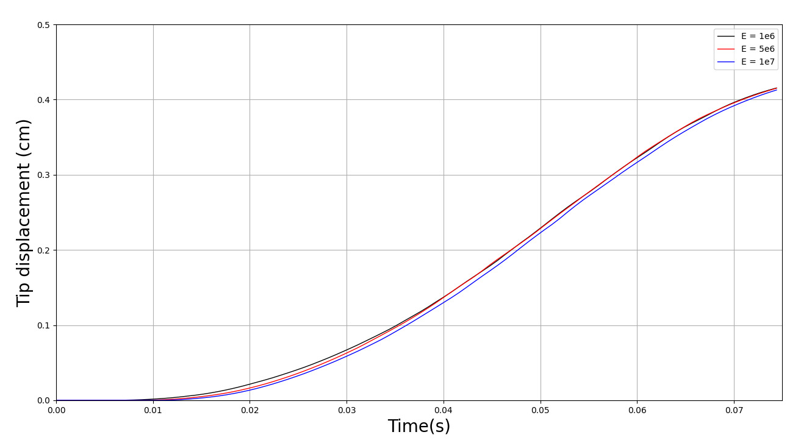
*Comparison of Tip displacement vs Time*

Beams with higher Young’s modulus (e.g., E = 1×10⁷ Pa) showed lower deformation, confirming the expected trend.

---

## 3. Tools Used

- FreeCAD  
- DualSPHysics

---

## 4. Results

The SPH model was successfully validated with mortar FEM results, proving its accuracy for simulating flexible structures in fluid domains. Variations in beam properties provided insights into deformation of flexible beams and fluid interaction.

Further, geometry parameters such as beam dimensions or fluid profile can be varied. Additionally, group behavior of multiple beams can be studied to assess their collective effect on fluid dynamics. These findings have strong potential in offshore structures, marine environments, and flexible structures for fluid-based systems.

---
