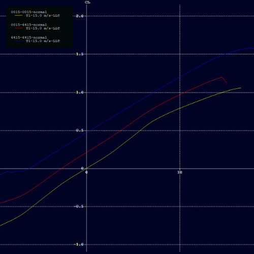
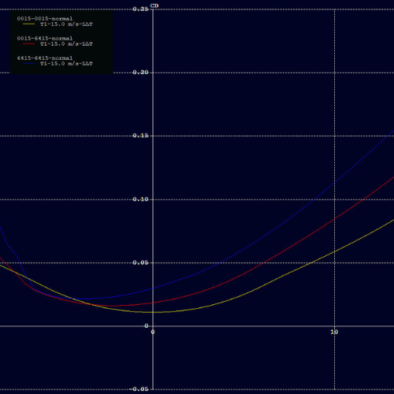
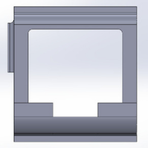

# Integrated Camber and Twist Morphing Wing for Unmanned-Aerial Vehicles

## 1. Introduction

Morphing wings are an exciting advancement in aircraft design that allows the wings to change shape during flight. Inspired by nature's adaptability, this innovative concept has the potential to greatly improve the performance and efficiency of aircraft. This project explores a novel mechanism that integrates both **camber** and **twist morphing** to improve aerodynamic efficiency, maneuverability, and versatility.

Morphing wings are designed to change their shape and configuration while the aircraft is in motion. This ability enables the wings to optimize their performance in different flight situations. For example, during takeoff and landing, the wings can morph to provide more lift, allowing for shorter runways and safer landings. In cruising mode, the wings can adjust their shape to reduce drag, leading to fuel efficiency and longer flight ranges. By adapting to changing conditions, morphing wings offer improved maneuverability, allowing aircraft to execute precise aerial maneuvers. Traditional aircraft designs rely on flaps and ailerons, which increase weight and mechanical complexity. Morphing mechanisms aim to minimize these components by embedding adaptability directly into the structure.

### Morphing Mechanisms:

  - **Span morphing**: It is the ability to change the wing's span, or distance between the wingtips. Upon reducing the span during low-speed operations, such as maneuvering in tight spaces, improves agility and maneuverability. On the other hand, increasing the span during cruising enhances lift generation, and allows for longer-range flights.
  - **Chord length morphing** - It allows for modifications in the distance between the leading edge and the trailing edge of the airfoil. Increasing the chord length enhances lift capacity, and stability. Conversely, reducing the chord length reduces drag and improves maneuverability, making it suitable for agile flight and quick turns.
  - **Sweep angle morphing** - It involves adjusting the angle between the wing's centerline and a line perpendicular to the wing root. A higher sweep angle is beneficial for supersonic flight as it helps reduce wave drag. On the other hand, a lower sweep angle enhances maneuverability and control during subsonic flight, making it advantageous for takeoff, landing, and low-speed operations.
  - **Camber morphing** - It involves changing the curvature or shape of the airfoil. On increasing camber during takeoff and landing, helps to generate more lift at low speeds. In contrast, reducing camber during high-speed flight reduces drag and increases efficiency by maintaining a streamlined profile.
  - **Twist morphing** - It involves altering the twist distribution along the wing's span. With zero twist angle, results minimal drag and improves high-speed
performance by maintaining a streamlined wing profile. Increasing the twist angle can enhance maneuverability and control during low-speed flight or when performing complex maneuvers.
    
This project specifically targets an integrated (Camber and Twist) morphing design using two airfoils — **NACA0015** and **NACA6415** — with a morphing mechanism to transition between them. The rib-based design offers localized control of wing shape, and the prototype is fabricated using 3D printing technologies. The concept is experimentally validated through deformation tests.

---

## 2. Methodologies

### 2.1 Airfoil Selection

Two airfoils were selected:
- **NACA0015**: A symmetric airfoil, providing balanced lift distribution and its low drag characteristics at moderate angles of attack make it suitable for high-speed flight conditions.
  
- **NACA6415**: An asymmetric airfoil with high lift and improved lift-to-drag ratios, suitable for high-load or high-lift scenarios.
  

A rotational adjustment of 4° was applied to the NACA6415 to align maximum thickness regions of both the airfoils (in order to accomodate actuation mechanisms), enabling seamless transition from NACA0015 to NACA6415.

The maximum deflection in the trailing edge is in the tip of about 20mm and in the leading edge of about 6mm for a chord length of 20cm.

### 2.2 Aerodynamic Analysis

The primary task is to conduct analysis on the airfoils NACA0015 and NACA6415 and study their respective characteristics such as Cl vs AoA, Cd vs AoA at Re=200,000. A C-type structured mesh was created with 215000 nodes.

*C-domain meshing of NACA0015*

The analysis model was set up to compute in steady state, pressure-based results for the airfoils with a constant inflow velocity of air at 15m/s. The model was run for calculations with 1000 iterations for multiple Angle of Attacks of both the airfoils and results were obtained.

  
*Lift vs AoA (Left) and Drag vs AoA (Right)*

From the graphs, it is inferred that the NACA0015 airfoil provides the least drag and the NACA6415 airfoil provides comparatively high lift.

### 2.3 Wing Configurations

To achieve the capability of different camber at each rib along the span of the wing, a mechanism is designed to be placed separately at each rib. This mechanism
allows for independent control and adjustment of the camber of each individual rib. By implementing this design, it becomes possible to dynamically alter the camber of each rib along the span of the wing simultaneously or independently as required.

Possible configurations were explored using rib-based camber control:
1. **Same airfoil at both ends** (NACA0015 or NACA6415)
   
   *NACA0015 on both ends*

    

   
   *NACA6415 on both ends*
   
2. **Different airfoils at root and tip**
   
   
   *NACA0015 at root and NACA6415 at wingtip*

Preliminary analysis using XFOIL for a 1m span and 20cm chord wing showed the NACA6415 configuration generating the highest lift, while NACA0015 offered minimal drag (similar to airfoil analysis).

  
*Lift vs AoA (Left) and Drag vs AoA (Right)*

### 2.4 Preliminary Design

#### Rib Mechanism

Each rib consists of:
- The **center portion** of the rib is the rigid portion where the actuator will be placed for the actuation of the trailing edge and leading edge.
      
  
  *Side, Front and Isometric view of center rigid portion*

- The **trailing edge** has thin plate on the top which allows for bending to occur when a force is applied on the trailing edge tip. The V-shaped trusses are equally placed along the trailing edge which helps in achieving the required final shape and it also helps to keep the flexible skin remain in intact in the final morphed airfoil shape. Flexible rods will be placed through the holes provided at the bottom of the trailing edge structure connecting the part at the trailing edge of the structure and the actuator which is present at the center rigid portion.
  
  
- The **leading edge** has a simple hinge mechanism to deform the required portion due to small space. The actuator is rotated 8 degrees about the hinge in front the rigid portion to achieve the required motion.
  

Once, the rib structures are arranged along the wing, there will be a flexible outer skin covering all the internal rib structure which is also similar to the
same airfoil profile. This flexible skin will provide a smooth surface exposed to the air(fluid). Rods and actuators allow localized control over each rib’s shape, enabling multiple camber configurations along the span.

*Final inner structure of the rib*

#### Materials Used

| Material | Density (kg/m³) | Young’s Modulus (MPa) | Yield Strength (MPa) | Poisson’s Ratio |
|---------|------------------|------------------------|-----------------------|------------------|
| PLA     | 1240             | 3292                   | 59                    | 0.33             |
| TPU     | 1450             | 2580                   | 63.6                  | 0.38             |

- **PLA** has been chosen for the rigid portion and trailing edge of the wing. PLA is a commonly used 3D printing material known for its rigidity, durability, and
ease of processing. The top of the trailing edge in a thickness range of 1mm-2mm, the PLA components allows for controlled bending and deformation, enabling the desired morphing capabilities of the wing.
- **TPU** is selected for the leading edge due to its flexibility. TPU is a flexible and elastomeric material with excellent elasticity, and resilience. It offers superior flexibility and deformability, making it suitable for components requiring flexibility and small size constraints.

#### Structural Analysis

- The mechanical properties of the material were applied to the trailing edge, and it was further meshed with fine settings. The entire center portion is considered as fixed geometry and a load of 1.5N was applied to the faces at the end of the trailing edge structure where the flexible rods from the actuator will end. This applied force essentially bends the structure.

- Max stress: 24 MPa (Yield strength - 59 MPa; Factor of Safety > 2)
  
  
  *Stress plot (Left) and Strain plot(Right)*

   
  
- Max deformation: 20.41 mm at trailing edge tip
  
  *Deformation plot*
  
- Deformed profile aligns closely with NACA6415
  

### 2.5 Prototype Testing

The initial prototype of rib structure was 3D printed using PLA and TPU and assembled to validate the mechanism.

- Rigid portion: PLA
- Trailing edge: PLA (1–2 mm thick plate for controlled bending)
- Leading edge: TPU (flexible and elastic)

  
  *Leading edge - TPU (Left) and Center portion - PLA (Right)*
  
  
  *Overall assembly (Left) and Center portion with servo (Right)*

### 2.6 Twist Morphing Concept

The morphing wing system in this project incorporates camber morphing mechanism that operates separately for each rib. However, for achieving twist morphing, two possible approaches have been considered.

- Method 1: A cylindrical spar can be utilized as the main spar of the wing. By twisting the cylindrical spar along the span, the desired twist distribution can be achieved.
- Method 2: The ribs can be individually rotated about the main spar to achieve twist morphing. By independently adjusting the rotation of each rib, the desired twist distribution can be attained.

The decision on whether to employ the circular spar twisting or individual rib rotation will be determined based on the structural strength and integrity of the entire wing assembly. Both strategies aim to integrate twist without compromising camber control.

---

## 3. Tools Used

| Tool | Purpose |
|------|---------|
| **SolidWorks, Fusion360** | CAD modelling and assembly |
| **ANSYS Static Structural** | Structural stress and deformation evaluation |
| **XFOIL** | Preliminary aerodynamic performance of wing configurations |
| **ANSYS Fluent** | Aerodynamic analysis of airfoils |
| **3D Printing** | Prototyping components |

---

## 4. Results and Future Scope

The camber morphing mechanism effectively transitioned between NACA0015 and NACA6415 airfoils. Simulation and experimental deformation data show close alignment:

| Part         | Computational Deformation | Experimental Deformation |
|--------------|---------------------------|---------------------------|
| Leading Edge | 5.9 mm                    | 7 mm                      |
| Trailing Edge| 20 mm                     | 23 mm                     |

Fatigue testing of 3D printed ribs is ongoing to assess long-term performance.

**Future Work Includes:**
- Implementation of twist morphing mechanism
- Full wing assembly with integrated spar and ribs
- Finalization of outer skin material with suitable flexibility and stiffness
- Integration into a UAV platform for field testing and real-flight validation

This project establishes a significant foundation for the development of adaptive, high-performance wings for UAVs.

